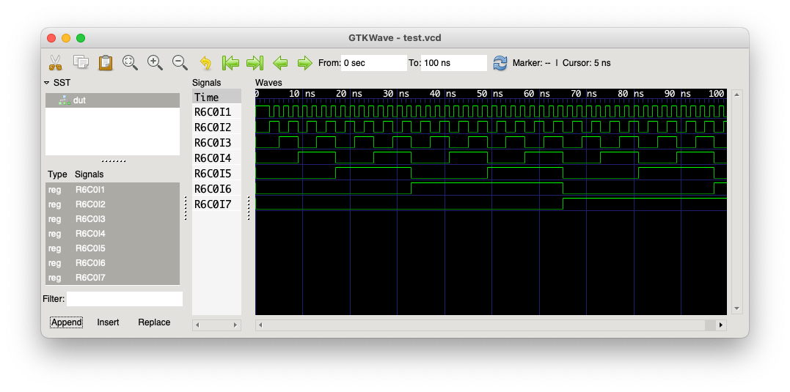
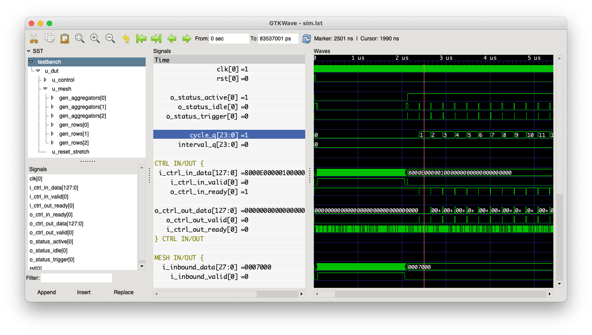

<p align="center">
    
</p>

<p align="center">
    Open source RTL simulation acceleration on commodity hardware
</p>

---

## What is Nexus?
Nexus aims to accelerate RTL simulations on commodity FPGA hardware using only free or opensource tools. At present, the system is only a proof-of-concept as the maximum capacity of a 256 node mesh would be 2048 flops, with this configuration easily filling a Xilinx XC7A200T (largest Xilinx FPGA not requiring a paid license). There is lots of scope for refining the system to increase its capacity, some of which are detailed in sections below.

At the heart of Nexus is a mesh processor. Each node in the mesh is a logic processor able to perform boolean logic functions on an array of input signals to produce an array of output signals. The node executes a very simple instruction set, only consisting of logic manipulations (e.g. AND, OR, INVERT) without jump or branch operations. An internal array of working registers allow temporary values to be stored and reused, while results can be exposed as outputs to other nodes in the mesh.

Flop-to-flop logic operations will ideally complete within a single node, but sometimes the capacity of one node is not enough (too many logic stages or input signals) in which case an operation can span over multiple nodes in the mesh. Signal state is communicated through a mesh-based messaging fabric, allowing every node in the mesh to communicate with any other node either directly or through broadcast. Both sequential and combinatorial values are passed by through the fabric, but how the receiver handles them is different:

 * Combinatorial updates cause instruction execution within the receiving node to restart, using the new value;
 * Sequential updates are held by the receiving node's control block until the next simulated clock cycle, then used as the inputs to the next run through the instruction list.

Whether signal state is combinatorial or sequential is decided by the input configuration of the receiving node, the node emitting the state message is not aware of how it will be consumed.

The same messaging fabric used for carrying the signal state updates is also used to load instructions into each node as well as configuring the input and output signal mappings. The messaging fabric is flexible, and new message types could be added in future to support new functionality.

The backbone of the messaging fabric is built right into the node, with each node able to communicate with its neighbour to the north, east, south, and west. This simplifies the design of the system, removing the need for an independent framework for message parsing, and allows reuse of each node's message decoder for routing messages.

A global 'trigger' signal synchronises the operation of all nodes in the mesh. The trigger pulses high to start each simulated clock cycle, and won't rise again until all nodes return to their idle state. This allows simulated time to be halted on any clock boundary, and will be key in providing external stimulus to the design.

## Limitations
As Nexus is only a proof-of-concept, there are number of major limitations to be aware of:

 1. Capacity is currently very limited - a 256 node mesh can support a maximum of 2048 flops providing every input is sequential.
 2. Only a single clock domain is supported and logic can only be rising edge triggered.
 3. Flops can only be reset to a low logic state.
 4. External inputs are not yet supported - designs must be self-sustaining (outputs are accessible).
 5. Only output signal values can be recorded, no ability to probe into the design.
 6. No form of debug triggering exists (i.e. cannot wait for a certain signal value).
 7. Mesh network can easily deadlock, current workaround is a large (expensive) FIFO inside each node but a better solution needs to be found.
 8. Constants will be propagated through flops regardless of their reset value, this means any logic requiring a state for a single cycle after reset will be broken.
 9. Only gates and flops are currently supported - RAMs, ROMs, and other types of memory are not.
 10. No support for bidirectional I/O.

These limitations will be overcome in time, some of them are only due to the current software maturity (e.g. 3 & 4) as the mesh is already capable of supporting them.

## Planned Improvements
From this proof-of-concept design, there are a number of obvious improvements required:

 * Find a proper solution to deadlock or at least significantly lowering the chance of deadlock;
 * Stop using broadcast messages for signal state as this creates a lot of unnecessary noise;
 * Store output messages in RAM using the second port to allow for a much larger number of unique outputs;
 * Encode input signal position as well as target row and column in output message, this will simplify the input mapping function which becomes very large as the number of inputs are increased;
 * Use temporary registers to hold state between cycles allowing for flops to exist within a node - at the moment a flop can only exist on the inputs to a node, which means extra hardware to handle mapping outputs back to inputs (wastes I/O and is more costly than necessary);
 * Add a control command allowing for the behaviour of nodes to be configured dynamically.

In addition to these improvements - work needs to be done to map Nexus onto an FPGA. Initial out-of-context synthesis trials have produced resource utilisation figures, but this has been done without timing or any form of interface with an external system.

## Technology Stack
The mesh itself is a relatively simple machine, and is intrinsically linked to a custom compiler to make it behave in a sensible fashion. The compiler in turn relies on [yosys](https://github.com/YosysHQ/yosys) to perform the transformation from RTL into a generic cell mapped design.

### nxcompile
Starting with the JSON export of the synthesised RTL from [yosys](https://github.com/YosysHQ/yosys), the compiler is responsible for producing a design which can run on the mesh. This not only includes producing the instruction listing for each node, but also the input and output mappings, and the messages which pass between the nodes.

The compiler works through a number of steps to transform the design:

 1. Flattens all hierarchy from the Yosys export creating a single module containing all logical operations;
 2. Performs constant propagation to simplify the design - stripping out any gates or flops that produce a static value (see limitation 8 above);
 3. Duplicated gates are eliminated;
 4. Chains of inverters are truncated;
 5. Gates and flops are then converted into instructions and input/output mappings (without yet assigning them to a node);
 6. Placement of each instruction then starts following the procedure:
    1. First operation is placed into any node;
    2. If the next operation is not dependent on any previous operation, it is placed into the next node with spare capacity;
    3. If the next operation is dependent on a previous operation then the compiler will:
        * attempt to place it into the same node as the operation it depends upon,
        * if that's not possible then the compiler will attempt to transfer the entire logic tree (including the new operation) into a different node,
        * finally if the operation still isn't placed then the compiler will place it in the nearest node with spare capacity.
 7. Once all operations are placed, the compiler then runs a further compilation step on each node which assigns input and output positions as well as use of the temporary registers.
 8. Finally, input and output positions are linked to configure the messages each node will produce.

The compiler can undoubtedly be optimised to improve instruction placement as well as input and output mappings, this will help to increase the capacity of the platform.

The compiler can be run by executing `./bin/nxcompile` or `python3 -m nxcompile` - an example of its use is shown in a section below.

### nxmodel
To aid development of the compiler and provide a golden reference for the RTL design, an architectural model of Nexus was developed using the [SimPy](http://simpy.readthedocs.io) discrete event simulation framework. This tool can model any configuration of the mesh, and provides VCD capture as well as debug logging as the design runs.

Just like the RTL design, the model is composed of nodes within a mesh:

 * The `Node` class, defined in `nxmodel/node.py`, represents a single node and can decode and execute instructions produced by the compiler. It is also responsible for consuming, routing, decoding, and emitting messages (which are defined in `nxmodel/message.py`).
 * The `Mesh` class, defined in `nxmodel/mesh.py`, sets up the required number of `Node` instances and links them together.

The model can be run by executing `./bin/nxmodel` or `python3 -m nxmodel`.

### nxdisasm
Debugging a design spread across a mesh network is tricky, especially when the compiler and model are untrusted. To go some way to solving this problem, the disassembler consumes a design produced by `nxcompile` and produces two outputs:

 * A listing of the instruction set for every node in the design (helpful for hand-calculating the output state);
 * A Verilog version of the translated design, which can be simulated under the same testbench to check for consistent behaviour in a trusted simulator.

The disassembler can be run by executing `./bin/nxdisasm` or `python3 -m nxdisasm`.

## Getting Started
This section will walk through the steps of setting up a suitable build environment for Nexus, compiling an example design, and running it on the model and RTL.

### Setup
You will need a few tools to be installed on your system:

 * Python 3.9 or newer (older versions may work but are untested);
 * [Icarus Verilog](http://iverilog.icarus.com);
 * [yosys](https://github.com/YosysHQ/yosys);
 * GNU Make.

Once this baseline is available, you will also need to install a number of Python packages - you may wish to do this in a virtual environment. The easiest way to do this is to use the `requirements.txt` file:

```bash
$> python3 -m virtualenv venv
$> . ./venv/bin/activate
$> pip install -r requirements.txt
```

As a future improvement, a [pyenv](https://github.com/pyenv/pyenv) configuration could be provided to simplify this setup process.

### Running Synthesis
The first step is to get a JSON export of a generic mapped synthesised design from yosys. Here we will use `tests/multilayer_8bit` which is an example design containing two 8-bit counters which feed an 8-bit adder with overflow which drives the output signals.

```bash
$> cd tests/multilayer_8bit
$> make synth
```

This should run yosys and produce a file `work/Top.json` which contains the synthesised design. The steps performed in this synthesis operation are shown below (also visible in `work/yosys.do`):

```
read -incdir .../nexus/tests/multilayer_8bit/rtl;
read -sv .../nexus/tests/multilayer_8bit/rtl/adder.v;
read -sv .../nexus/tests/multilayer_8bit/rtl/counter.v;
read -sv .../nexus/tests/multilayer_8bit/rtl/top.v;
hierarchy -top Top;
proc;
fsm;
opt;
memory;
opt;
write_json -aig Top.json;
```

### Compiling onto the Mesh
The next step is to run `nxcompile` to produce a design compatible with the Nexus mesh. In this example a 6x6 (36 node) mesh is used. Starting from the root of the `nexus` directory:

```bash
$> ./bin/nxcompile tests/multilayer_8bit/work/Top.json Top nx_top.json --rows 6 --cols 6
```

The arguments given to `nxcompile` are:

 * `tests/multilayer_8bit/work/Top.json` - this is the output JSON file from yosys containing the synthesised design;
 * `Top` - name of the top level of the design to compile;
 * `nx_top.json` - name of the output file containing the compiled design;
 * `--rows 6` - number of rows in the target mesh;
 * `--cols 6` - number of columns in the target mesh.

This will take a second or two to run, and will print out mesh utilisation reports when it completes.

If you take a look at the compiled design in `nx_top.json`, you will see a section for each node including the instructions to execute as well as the input and output configurations.

### Disassembling the Design
This step is not usually required, but is useful for debugging. Here we'll use `nxdisasm` to parse the compiler output and produce instruction listings as well a Verilog version of the translated design:

```bash
$> ./bin/nxdisasm nx_top.json --listing listing.txt --verilog nx_top.v
```

The arguments given to `nxdisasm` are:

 * `nx_top.json` - this is the output from the compiler;
 * `--listing listing.txt` - request a dump of the instruction listings for every node into `listing.txt`;
 * `--verilog nx_top.v` - translate the compiled design back into Verilog.

The instruction listing will look something like:

```
# ==============================================================================
# Row 000, Column 000
# ==============================================================================
000: AND[0x01](I[0],I[1]) -> R[0] -> O
001: AND[0x01](I[2],I[3]) -> R[1]
002: NAND[0x02](R[0],R[1]) -> R[2]
003: NAND[0x02](I[4],I[5]) -> R[0]
004: AND[0x01](R[2],R[0]) -> R[1] -> O
005: INVERT[0x00](I[6],R[0]) -> R[0] -> O
...
```

While the translated Verilog will start with something similar to:

```Verilog
module Top (
      input  wire clk
    , input  wire rst
    , output wire Top_sum_1
    , output wire Top_sum_0
    , output wire Top_sum_6
    , output wire Top_sum_4
    , output wire Top_overflow_0
    , output wire Top_sum_2
    , output wire Top_sum_7
    , output wire Top_sum_3
    , output wire Top_sum_5
);

// =============================================================================
// Row 000, Column 000
// =============================================================================

// Input Construction
reg  r0_c0_input_0;
reg  r0_c0_input_1;
...
```

### Simulating Using the Model
A compiled design can be simulated using `nxmodel` which provides a golden reference for the RTL behaviour:

```bash
$> ./bin/nxmodel nx_top.json --rows 6 --cols 6 --cycles 100 --vcd test.vcd
00000415 nxmodel : Checking all instructions loaded correctly
00000415 nxmodel : All OK!
00000415 nxmodel : Generating tick 1
00000415 nxmodel : Captured 0 outputs from tick 0
...
# ==============================================================================
# Simulation Statistics
# ==============================================================================
#
# Simulated Cycles   : 100
# Elapsed Clock Ticks: 4678
# Elapsed Real Time  : 5.35 seconds
# Cycles/second      : 18.71
#
# ==============================================================================
```

The arguments here are:

 * `nx_top.json` - this is the output from the compiler;
 * `--rows 6` - tells the model how many rows should be in the mesh;
 * `--cols 6` - tells the model how many columns should be in the mesh;
 * `--cycles 100` - how many cycles the simulation should run for;
 * `--vcd test.vcd` - captures the mesh state and outputs into a VCD as the simulation runs.

A tool like GTKWave can be used to view the captured VCD:



### Running on the Real RTL
The most exciting part of course is running the compiled design on the real Nexus mesh RTL. The `hardware` folder contains the full RTL of the design, along with a number of [cocotb](https://github.com/cocotb/cocotb) testbenches for verifying the behaviour of each block.

The bench we're interested in here is `hardware/testbench/nexus` - which can cosimulate the entire Nexus mesh against the behaviour of `nxmodel` cross checking all signal state after each simulated cycle. The `mission_mode` testcase (defined in `hardware/testbench/nexus/testbench/testcases/mission.py`) is already setup to do this, and will run the design contained in `hardware/testbench/nexus/testbench/data/design.json`.

```bash
$> cp nx_top.json hardware/testbench/nexus/testbench/data/design.json
$> cd hardware/testbench/nexus
$> make run TESTCASE=mission_mode EN_WAVES=yes
```

This will run the simulation for 256 cycles, checking against the golden reference model after every cycle and reporting any failures that occur. Using `EN_WAVES=yes` will enable wave capture of the mesh as it runs.

Once the simulation completes, you can use GTKWave to view the LXT wave file `sim.lxt`:

```bash
$> gtkwave sim.lxt nexus.gtkw
```


