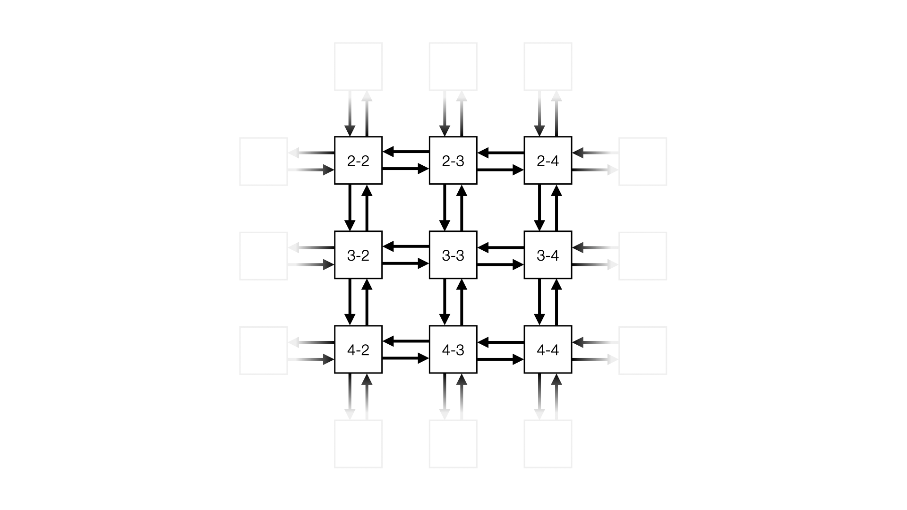
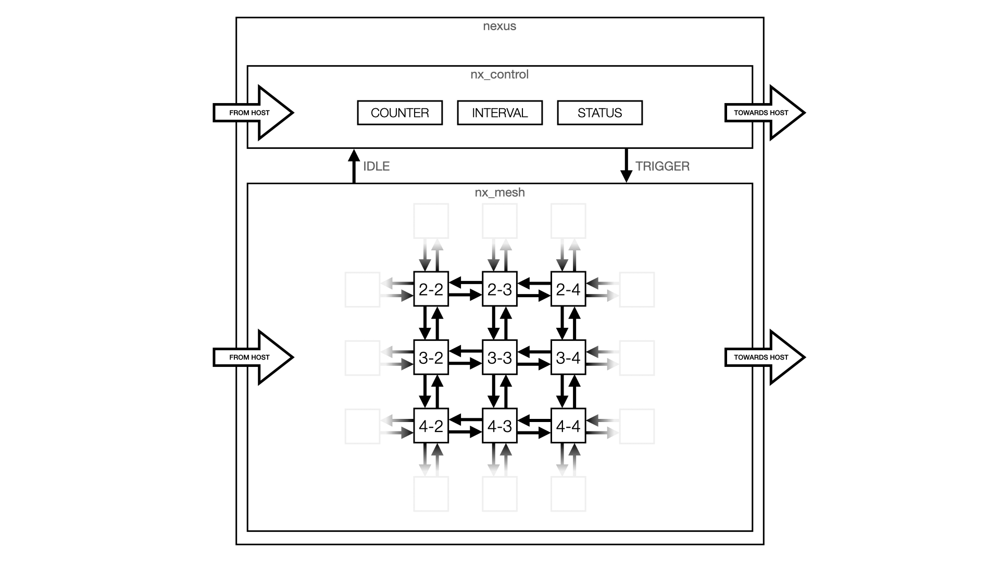
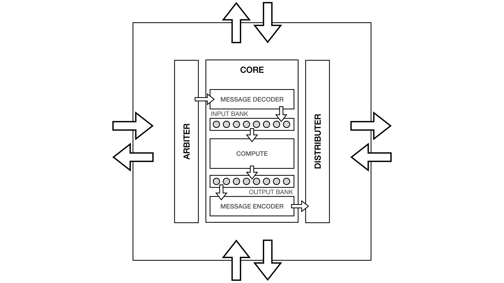
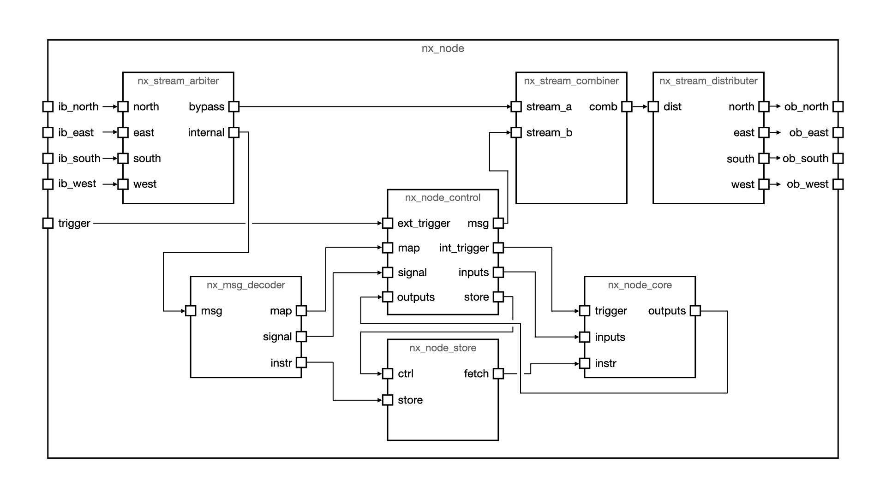

    

---

# Architecture

Nexus is made up of small compute nodes which each model a fraction of the simulated circuit. To reach the capacity required to simulate a useful amount of logic, a large number of compute nodes are connected together to form a mesh. Messages emitted by nodes can be routed through the mesh to target any other node in the device, or to communicate with the host system.

Figure 1 shows a high-level abstraction of this architecture - in this example 9 nodes are shown that make up just a section of a much larger mesh. Each node is connected to its nearest neighbours to the north, east, south, and west - with every link being bidirectional. Messaging routing is built right into each node, reusing a lot of the same logic used to detect messages addressed to the node itself.

Figure 1: High-level view of the mesh

The mesh can also exchange messages with a host system, allowing software to program the device, and monitor and provide stimulus to the simulation as it runs. To minimise resource usage and provide scope for future expandability, host communication shares the same fabric used to communicate between nodes.

As figure 2 shows, Nexus also contains a layer of control logic which manages the simulation process. Two key signals pass between the control layer and the mesh:

 * `IDLE` - indicates when the mesh is quiescent, at this time the control logic prepares for and triggers the next simulation period. This signal is an aggregated status from every node within the mesh.
 * `TRIGGER` - broadcast to all nodes within the mesh to signal the start of the next simulation step, this is equivalent to the rising clock edge.

When the control logic's `ACTIVE` flag is driven high it will wait until it sees the `IDLE` signal go high before pulsing the `TRIGGER` signal for a single cycle. The control logic then waits until it sees the `IDLE` signal fall, before the process repeats itself. Each pass through this loop represents one simulated clock cycle, and the loop will continue to run for as long as the `ACTIVE` flag is high.

When the mesh is quiescent (i.e. `IDLE` is high) this means that all computation for that cycle has completed and all emitted messages have been delivered. When the `TRIGGER` pulse goes high, every node will immediately start computing the cycle's outputs from the current input values. Every time a node's output value changes, it will emit a message to configurable list of targets. When messages are consumed by a target node they can either be treated:

 * Sequentially: in which case only the input values for the next cycle are updated.
 * Combinatorially: in which case the input values for both the current and next cycle are updated, and execution of the target node's computation is restarted.

Figure 2: Top-level of Nexus

Each node in the mesh needs to be configurable by the host; capable of decoding, enacting, and emitting messages; and able to route traffic intended for other nodes through to the correct egress port. Figure 3 displays an architectural model of the node, it shows:

 * Four ingress ports from the nearest neighbours to the north, east, south, and west;
 * Four egress ports towards the nearest neighbours to the north, east, south, and west;
 * An arbiter which takes one message per cycle from each of the ingress ports in a round-robin fashion;
 * A distributer which sends one message per cycle towards the egress ports according to its addressing;
 * A logical core which comprises:
   * A message decoder to handle the arbitrated ingress stream;
   * Banks of input values, updated by messages received from other nodes in the mesh;
   * A compute unit to execute a proprietary instruction which transforms the input values into outputs;
   * Banks of output values, updated by the results from the compute unit;
   * A message encoder generating messages detailing every output value update, which are sent to other nodes in the mesh.

Figure 3: Architectural representation of the node

Figure 4 shows a more detailed view of the implementation of each node:

 * `nx_stream_arbiter` - selects one message per cycle from the four ingress streams, and identifies whether traffic is addressed to this node (`internal`) or whether it needs to be routed towards another node (`bypass`).
 * `nx_stream_combiner` - selects between messages sent down the bypass channel by the arbiter, and those emitted by the node's control block. Bypassed traffic is always prioritised as an attempt to avoid congestion within the mesh by limiting the number of messages that can be emitted when the fabric is already busy.
 * `nx_stream_distributer` - routes the message towards the correct nearest neighbour based on the knowledge of the present node's location and the intended target as described in each message's header.
 * `nx_msg_decoder` - decodes messages arriving from the arbiter which are addressed to the associated node. The message decoder then drives a number of busses which interface with the control block and instruction store.
 * `nx_node_control` - manages the state of the node. This includes handling signal state updates to inputs from the message decoder, emitting signal state updates whenever an output value changes, and generating trigger pulses when the internal computation needs to be rerun (either on a global trigger pulse, or when combinatorial input updates are presented).
 * `nx_node_store` - is a wrapper around a Xilinx dual-port block RAM (`RAMB36E1`) that serves two purposes:
   * Firstly, it stores the instructions for the logic core - these are programmed directly by the message decoder, then read back by the logic core when the program executes.
   * Secondly, it stores the output message configurations - these are managed by `nx_node_control`, which writes and reads from the store as appropriate.
 * `nx_node_core` - the core which performs the actual logical operations, transforming the input values into output values using the instructions held within the node's store.

The message and control infrastructure within each node dominates the resource usage. By comparison the logical core (`nx_node_core`) only makes up a small fraction of the required LUTs and other resources. However the infrastructure around the logical node is very capable and extensible, and so it should be possible to increase the compute capability without radical changes to the infrastructure, and hopefully improve this ratio.

Figure 4: Implementation details of the node

