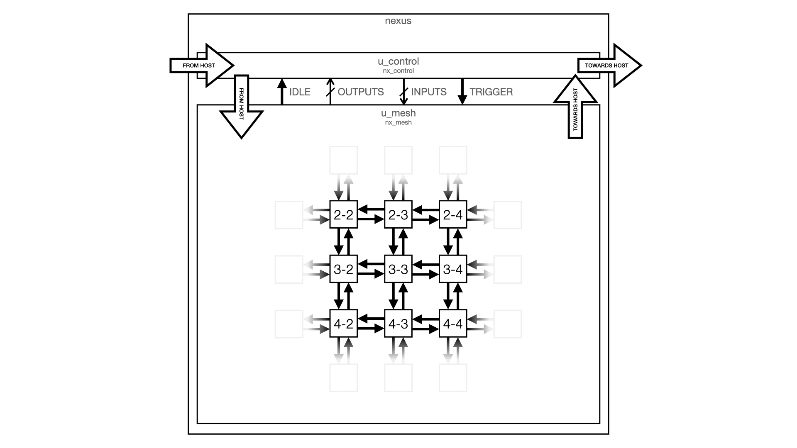

    

---

# Architecture

Nexus is made up of small compute nodes which each model a fraction of the
simulated circuit. To reach the capacity required to simulate a useful amount of
logic, a large number of compute nodes are connected together to form a mesh.
Messages emitted by nodes can be routed through the mesh to target any other
node in the device, or to communicate with the host system.

## Mesh

Figure 1 shows a high-level abstraction of this architecture - in this example 9
nodes are shown that make up just a section of a much larger mesh. Each node is
connected to its nearest neighbours to the north, east, south, and west - with
every link being bidirectional. Message routing is built right into each node,
reusing the same logic used to detect messages addressed to the node itself.

Figure 1: High-level view of the mesh

The mesh can also exchange messages with a host system, allowing software to
program the device, and monitor and provide stimulus to the simulation as it
runs. To minimise resource usage, host communication shares the same fabric used
to communicate between nodes.

As figure 2 shows, Nexus also contains a layer of control logic which manages
the simulation process. Two key signals pass between the control layer and the
mesh:

 * `IDLE` - indicates when the mesh is quiescent, at this time the control logic
   prepares for and triggers the next simulation period. This signal is an
   aggregated status from every node within the mesh.
 * `TRIGGER` - broadcast to all nodes within the mesh to signal the start of the
   next simulation step, this is equivalent to the rising clock edge.

When active the controller will emit a series of `TRIGGER` pulses. Between each
pulse the controller will wait until it sees the mesh's `IDLE` signal fall and
rise before the next pulse is emitted. Each iteration of this process represents
one simulated clock cycle, so the longer the mesh spends in a busy state the
slower the simulation runs.

When the mesh is quiescent (i.e. `IDLE` is high) this means that all computation
for that cycle has completed and all emitted messages have been delivered. When
the `TRIGGER` signal pulses, every node starts computing its outputs from the
current input values. Every time an output value changes, the node will emit a
message to configurable list of targets. When messages are consumed by a target
node they can either be treated:

 * Sequentially: in which case the updated values only take effect in the next
   clock cycle.
 * Combinationally: in which case the updated values take immediate effect, and
   the node's computation for the current cycle is restarted.

Figure 2: Top-level of Nexus

## Node

Each node in the mesh can be configured by the host, is capable of decoding,
enacting, and emitting messages, and is able to route traffic intended for other
nodes through to the correct egress port. Figure 3 show a simplified model of a
node with:

 * Four ingress ports from the nearest neighbours in each cardinal direction;
 * Four egress ports towards the nearest neighbours in each cardinal direction;
 * An arbiter which takes one message per cycle from each of the ingress ports
   in a round-robin fashion;
 * A distributer which sends one message per cycle towards the egress ports
   according to its header;
 * A logical core which comprises:
   * A message decoder to handle the arbitrated ingress stream;
   * Banks of input values, updated by messages received from other nodes;
   * A compute unit to execute the logical program which transforms the input
     values into outputs;
   * Banks of output values, updated by the results from the compute unit;
   * A message encoder generating messages according to the communication
     program, sending messages to other nodes in the mesh to update their input
     state.

Figure 3: Architectural representation of the node

Figure 4 shows a more detailed view of the implementation of each node:

 * `u_arbiter` - selects one message per cycle from the four ingress streams,
   and identifies whether traffic is addressed to this node (`internal`) or
   whether it needs to be routed towards another node (`bypass`).
 * `u_combiner` - selects between messages sent down the bypass channel by the
   arbiter, and those emitted by the node's control block. Bypassed traffic is
   always prioritised as an attempt to avoid congestion within the mesh by
   limiting the number of messages that can be emitted when the fabric is
   already busy.
 * `u_distributor` - routes the message towards the correct nearest neighbour
   based on the knowledge of the present node's location and the intended
   target as described in each message's header.
 * `u_decoder` - decodes messages arriving from the arbiter which are addressed
   to the associated node. The message decoder then drives a number of busses
   which interface with the control block and instruction store.
 * `u_control` - manages the state of the node. This includes handling signal
   state updates to inputs from the message decoder, emitting signal state
   updates whenever an output value changes, and generating trigger pulses when
   the internal computation needs to be rerun (either on a global trigger pulse,
   or when combinatorial input updates are presented).
 * `u_store` - is a wrapper around a Xilinx dual-port block RAM (`RAMB36E1`)
   that serves two purposes:
   * It stores the logical program executed by `u_core` which contains all of
     boolean transformations from input values to output values.
   * It also stores the communication program executed by `u_control`, which
     instructs the message generator on which target nodes need to be updated
     when a specific output changes.
 * `u_core` - the core which executes logical program, transforming the input
   values into output values using the encoded operations provided by `u_store`.

In terms of resource utilisation, the stream handling and control logic makes up
about two thirds of each node. By comparison, the logical core is fairly small
but depends heavily on the rest of the node's infrastructure.

Figure 4: Implementation details of the node

## Aggregators

While the body of the mesh is homogenously composed of `nx_node` instances, at
the bottom of each column is a special component called an 'aggregator'. This
component serves to reduce the required off-chip bandwidth and host-side
processing requirement by collecting all 'signal' messages directed out of the
mesh and presenting the result as a wide output bus. This bus is then connected
to the controller, which publishes the value to the host.

Figure 5: Aggregators at the bottom of the mesh

Without this bus, each bit of the output vector would be sent as a separate
message to the host - complete with its header and padding. Unsurprisingly this
is very inefficient, and places a substantial burden on the host to digest every
signal message. This is worsened by the way the mesh evaluates logic, as multiple
messsages for each bit of the output may be generated in a single cycle as the
signal 'settles' to its final value.

The aggregator components are also key to supporting on-device simulated memory
accesses, with specific bits of the output vector bound directly to each memory's
input ports.

## Controller

As shown in figure 2, the controller sits alongside the mesh in the top-level of
Nexus and provides stimulus into the fabric. It is responsible for:

 * Forwarding messages into the mesh from the host;
 * Forwarding messages to the host that are emitted by the mesh;
 * Monitoring the mesh's idle state and emitting trigger pulses;
 * Generating output messages from the exposed bus;
 * Handling memory accesses from the design to the simulated memories and
   driving the read value back into the mesh;
 * Handling backdoor memory access from the host to the simulated memories;
 * Supporting different run modes (continuous, single step, interval);
 * Performing soft resets on request from the host.

The controller is a substantial component in its own right, making up around 10%
of the total LUT utilisation of Nexus on FPGA. As discussed in the section on
aggregators above, by summarising the output state it significantly lowers the
bandwidth and computation requirement from the host. In addition, by offering
on-device simulated memories it allows the design to run without frequent stalls,
which would be required if every external I/O interaction required a host
response.
