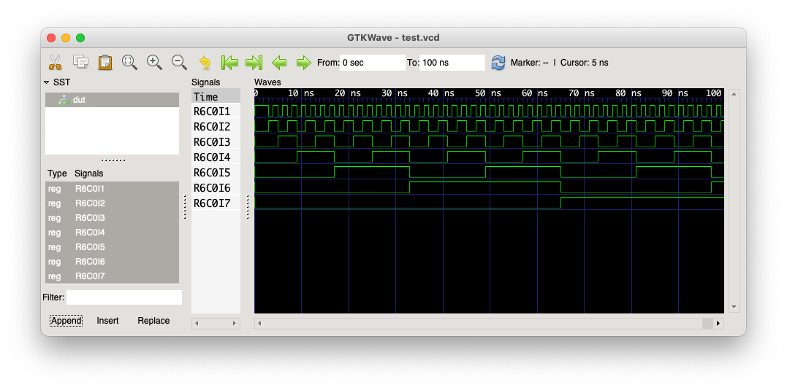

<p align="center">
    
</p>

---

# Getting Started
This section will walk through the steps of setting up a suitable build environment for Nexus, compiling an example design, and running it on the model and RTL.

## Setup
You will need a few tools to be installed on your system:

 * Python 3.9 or newer (older versions may work but are untested);
 * [Icarus Verilog](http://iverilog.icarus.com);
 * [yosys](https://github.com/YosysHQ/yosys);
 * GNU Make.

Once this baseline is available, you will also need to install a number of Python packages - you may wish to do this in a virtual environment. The easiest way to do this is to use the `requirements.txt` file:

```bash
$> python3 -m virtualenv venv
$> . ./venv/bin/activate
$> pip install -r requirements.txt
```

As a future improvement, a [pyenv](https://github.com/pyenv/pyenv) configuration could be provided to simplify this setup process.

## Running Synthesis
The first step is to get a JSON export of a generic mapped synthesised design from yosys. Here we will use `tests/multilayer_8bit` which is an example design containing two 8-bit counters which feed an 8-bit adder with overflow which drives the output signals.

```bash
$> cd tests/multilayer_8bit
$> make synth
```

This should run yosys and produce a file `work/Top.json` which contains the synthesised design. The steps performed in this synthesis operation are shown below (also visible in `work/yosys.do`):

```
read -incdir .../nexus/tests/multilayer_8bit/rtl;
read -sv .../nexus/tests/multilayer_8bit/rtl/adder.v;
read -sv .../nexus/tests/multilayer_8bit/rtl/counter.v;
read -sv .../nexus/tests/multilayer_8bit/rtl/top.v;
hierarchy -top Top;
proc;
fsm;
opt;
memory;
opt;
write_json -aig Top.json;
```

## Compiling onto the Mesh
The next step is to run `nxcompile` to produce a design compatible with the Nexus mesh. In this example a 6x6 (36 node) mesh is used. Starting from the root of the `nexus` directory:

```bash
$> ./bin/nxcompile tests/multilayer_8bit/work/Top.json Top nx_top.json --rows 6 --cols 6
```

The arguments given to `nxcompile` are:

 * `tests/multilayer_8bit/work/Top.json` - this is the output JSON file from yosys containing the synthesised design;
 * `Top` - name of the top level of the design to compile;
 * `nx_top.json` - name of the output file containing the compiled design;
 * `--rows 6` - number of rows in the target mesh;
 * `--cols 6` - number of columns in the target mesh.

This will take a second or two to run, and will print out mesh utilisation reports when it completes.

If you take a look at the compiled design in `nx_top.json`, you will see a section for each node including the instructions to execute as well as the input and output configurations.

## Disassembling the Design
This step is not usually required, but is useful for debugging. Here we'll use `nxdisasm` to parse the compiler output and produce instruction listings as well a Verilog version of the translated design:

```bash
$> ./bin/nxdisasm nx_top.json --listing listing.txt --verilog nx_top.v
```

The arguments given to `nxdisasm` are:

 * `nx_top.json` - this is the output from the compiler;
 * `--listing listing.txt` - request a dump of the instruction listings for every node into `listing.txt`;
 * `--verilog nx_top.v` - translate the compiled design back into Verilog.

The instruction listing will look something like:

```
# ==============================================================================
# Row 000, Column 000
# ==============================================================================
000: AND[0x01](I[0],I[1]) -> R[0] -> O
001: AND[0x01](I[2],I[3]) -> R[1]
002: NAND[0x02](R[0],R[1]) -> R[2]
003: NAND[0x02](I[4],I[5]) -> R[0]
004: AND[0x01](R[2],R[0]) -> R[1] -> O
005: INVERT[0x00](I[6],R[0]) -> R[0] -> O
...
```

While the translated Verilog will start with something similar to:

```Verilog
module Top (
      input  wire clk
    , input  wire rst
    , output wire Top_sum_1
    , output wire Top_sum_0
    , output wire Top_sum_6
    , output wire Top_sum_4
    , output wire Top_overflow_0
    , output wire Top_sum_2
    , output wire Top_sum_7
    , output wire Top_sum_3
    , output wire Top_sum_5
);

// =============================================================================
// Row 000, Column 000
// =============================================================================

// Input Construction
reg  r0_c0_input_0;
reg  r0_c0_input_1;
...
```

## Simulating Using the Model
A compiled design can be simulated using `nxmodel` which provides a golden reference for the RTL behaviour:

```bash
$> ./bin/nxmodel nx_top.json --rows 6 --cols 6 --cycles 100 --vcd test.vcd
00000415 nxmodel : Checking all instructions loaded correctly
00000415 nxmodel : All OK!
00000415 nxmodel : Generating tick 1
00000415 nxmodel : Captured 0 outputs from tick 0
...
# ==============================================================================
# Simulation Statistics
# ==============================================================================
#
# Simulated Cycles   : 100
# Elapsed Clock Ticks: 4678
# Elapsed Real Time  : 5.35 seconds
# Cycles/second      : 18.71
#
# ==============================================================================
```

The arguments here are:

 * `nx_top.json` - this is the output from the compiler;
 * `--rows 6` - tells the model how many rows should be in the mesh;
 * `--cols 6` - tells the model how many columns should be in the mesh;
 * `--cycles 100` - how many cycles the simulation should run for;
 * `--vcd test.vcd` - captures the mesh state and outputs into a VCD as the simulation runs.

A tool like GTKWave can be used to view the captured VCD:



## Running on the Real RTL
The most exciting part of course is running the compiled design on the real Nexus mesh RTL. The `hardware` folder contains the full RTL of the design, along with a number of [cocotb](https://github.com/cocotb/cocotb) testbenches for verifying the behaviour of each block.

The bench we're interested in here is `hardware/testbench/nexus` - which can cosimulate the entire Nexus mesh against the behaviour of `nxmodel` cross checking all signal state after each simulated cycle. The `mission_mode` testcase (defined in `hardware/testbench/nexus/testbench/testcases/mission.py`) is already setup to do this, and will run the design contained in `hardware/testbench/nexus/testbench/data/design.json`.

```bash
$> cp nx_top.json hardware/testbench/nexus/testbench/data/design.json
$> cd hardware/testbench/nexus
$> make run TESTCASE=mission_mode EN_WAVES=yes
```

This will run the simulation for 256 cycles, checking against the golden reference model after every cycle and reporting any failures that occur. Using `EN_WAVES=yes` will enable wave capture of the mesh as it runs.

Once the simulation completes, you can use GTKWave to view the LXT wave file `sim.lxt`:

```bash
$> gtkwave sim.lxt nexus.gtkw
```


