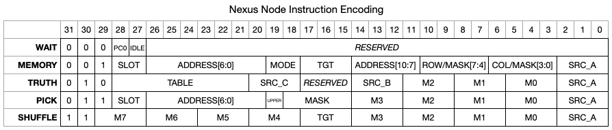

# NXNode ISA (v0.4)

## Encodings Table



## `WAIT`

The first instruction is used to stall execution until a trigger pulse arrives
from the controller, it carries two arguments:

 * `PC0` - when set, the program counter will reset to `0` when the trigger pulse
   arrives (effectively restarting the program), otherwise it will continue
   executing from the next instruction;
 * `IDLE` - when set, the node's `IDLE` flag will be set high to indicate that
   it's evaluation for this cycle is complete.

## `MEMORY`

This operation can perform load operations from the node's local memory and store
operations to both the node's local memory and any remote node's memory (in the
latter case this is known as a 'send').

The `MODE` field encodes the desired behaviour:

 * `LOAD` (`2b00`) - performs a load operation from local memory;
 * `STORE` (`2b01`) - performs a store operation to local memory;
 * `SEND` (`2b10`) - sends data via the mesh to update data in a remote memory.

In all cases, the address is encoded by 3 fields:

 * `ADDRESS[10:7]` and `ADDRESS[6:0]` refer to a specific 16-bit element within
   the local or remote memory;
 * `SLOT` selects between the upper and lower 8-bits of the 16-bit element.

The slot is encoded to support double buffering. Each node maintains a local bit
of state which alternates on each simulated cycle, allowing memory operations to
alternately target different 8-bit chunks.

 * `PRESERVE` (`2b00`) - uses the node's current slot state;
 * `INVERSE` (`2b01`) - uses the inverse of the node's current slot state;
 * `LOWER` (`2b10`) - forces use of the lower 8-bit slot;
 * `UPPER` (`2b11`) - forces use of the upper 8-bit slot.

Therefore the full 12-bit address of the 8-bit element of the memory can be
expressed as:

```
full_address = { ADDRESS[10:0], SLOT[1] ? SLOT[0] : (SLOT[0] ^ STATE) };
```

For `SEND` operations, bits `10:3` form the address of the target node encoded
as a 4-bit `ROW` and 4-bit `COLUMN`.

For `STORE` operations, bits `10:3` (`MASK`) hold an 8-bit mask which is used to
select which bits of the 8-bit slot should be updated.

For `SEND` and `STORE` operations, bits `2:0` (`SRC_A`) encode the source register
to take the value to write to memory.

For `LOAD` operations, bits `17:15` (`TGT`) encode the target register to store
the data read from the memory.

## `TRUTH`

Performs logical operations on up to 3x8-bit sources:

 * `SRC_A`, `SRC_B`, `SRC_C` - input register selections;
 * `MUX_2`, `MUX_1`, `MUX_0` - bit selection from each of the input registers;
 * `TABLE` - encoded truth table;

The `TRUTH` instruction does not have a target register, instead the result is
always placed into register 7. Register 7 is a shift register, and each new
value is inserted at bit 0 with existing entries shifted up one place.

## `PICK`

Selects up to 4-bits from a register and writes them to a limited area of the
data memory, this is particularly useful for shortening 'gather' sequences when
preparing messages to send to other nodes to update signal state.

 * `SRC_A` - input register selection;
 * `MUX_[3:0]` - selection values for each of the 4-bits to gather from the
   source register;
 * `MASK` - masks which bits selected using the `MUX_N` fields should be written
   to the local memory;
 * `UPPER` - selects the upper or lower 4-bits of the 8-bit slot within the memory;
 * `ADDRESS[6:0]` - a shortened address to select 16-bit elements within a limited
   range of the memory;
 * `SLOT` - selects the upper or lower 8-bit slot within the 16-bit element,
   using the same encoding mentioned above for the `MEMORY` operation.

The address range of the `PICK` instruction is limited, and is offset from the
base of the memory by `64`. That is to say that the minimum address is `0x40`
and the maximum address is `0xBF`.

## `SHUFFLE`

Rearranges the bits of an source register into an arbitrary order:

 * `SRC_A` - input register selection;
 * `TGT` - target register selection;
 * `MUX_[7-0]` - selection values for each bit in the target register from each
   bit in the source register.

Note that this register overloads bit 29 from being the operation encoding, to
being the MSB of the `B7` mux control.
